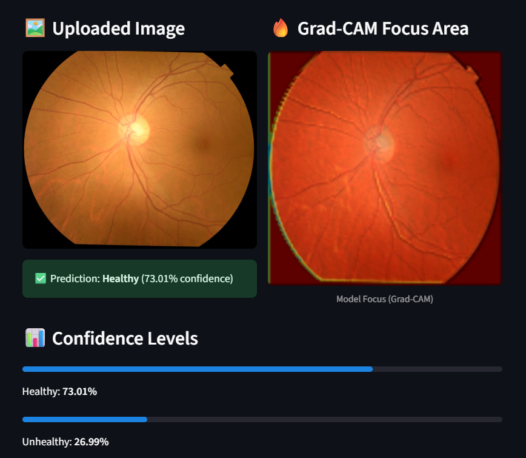
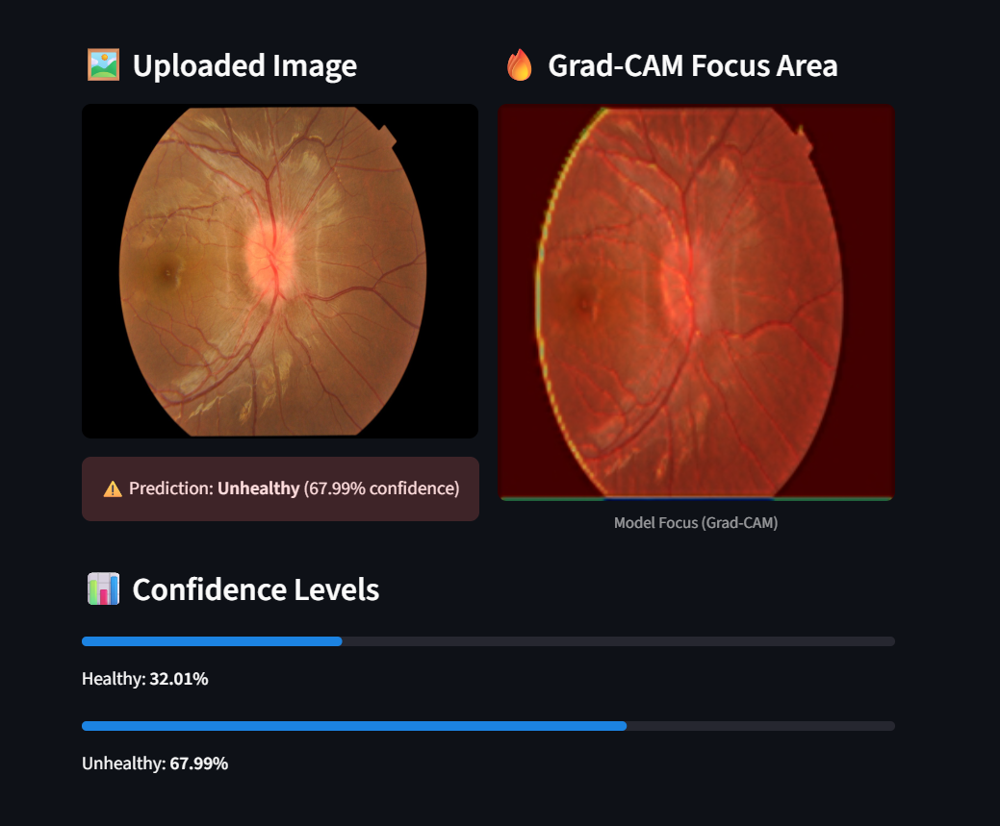

# 🧿 Iris Disease Detection

This project uses deep learning to detect iris disorders from eye images and provides model transparency using Grad-CAM heatmaps.

## Features

- **Binary Classification:** Healthy vs Unhealthy iris images
- **Transfer Learning:** MobileNetV2 (pre-trained on ImageNet)
- **Grad-CAM Visualization:** Shows model focus area for each prediction
- **Streamlit App:** Simple web interface for image upload and prediction

## 📊 Model Performance
- **Training Accuracy:** 90%  
- **Validation Accuracy:** 87%  

## How It Works

1. **Preprocessing:**  
   - Images resized to 224x224  
   - Pixel values normalized  
   - Data split into train/test sets

2. **Model:**  
   - MobileNetV2 base (frozen)  
   - Custom classification head for binary output  
   - Trained for 2–3 epochs

3. **Evaluation:**  
   - Accuracy and confusion matrix  
   - Training/validation loss and accuracy plots

4. **Explainability:**  
   - Grad-CAM heatmaps highlight regions the model focuses on

5. **Streamlit App:**  
   - Upload an iris image  
   - Get prediction and confidence  
   - See Grad-CAM heatmap overlay

## Getting Started

### 1. Clone the repository

```bash
git clone https://github.com/Hariom-Nagar211/Iris-Disease-Detection
cd Iris-Disease-Detection
```

### 2. Install dependencies

```bash
pip install -r requirements.txt
```

### 3. Train the model (optional)

Run the notebook to preprocess data, train, and save the model:

```bash
jupyter notebook Iris_Disease_Detection.ipynb
```

### 4. Run the Streamlit app

```bash
streamlit run app.py
```

## Dataset Structure

```
Dataset/
  Healthy/
    Healthy1.jpg
    ...
  Unhealthy/
    Unhealthy1.jpg
    ...
```

## Files

- `Iris_Disease_Detection.ipynb` — Model training, evaluation, Grad-CAM
- `app.py` — Streamlit web app for prediction and visualization
- `requirements.txt` — Python dependencies

## 🖼️ Example Predictions

### Healthy Iris


### Unhealthy Iris



**Made with ❤️ using TensorFlow, Keras, and Streamlit**